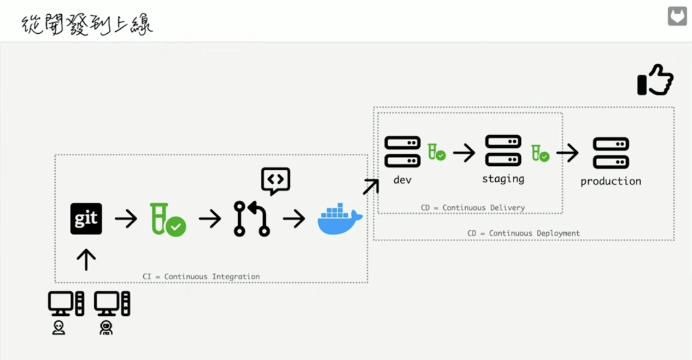
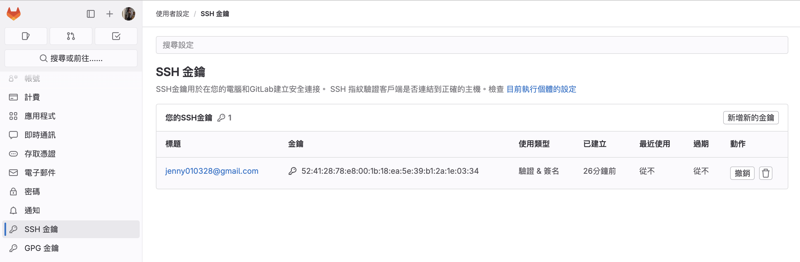
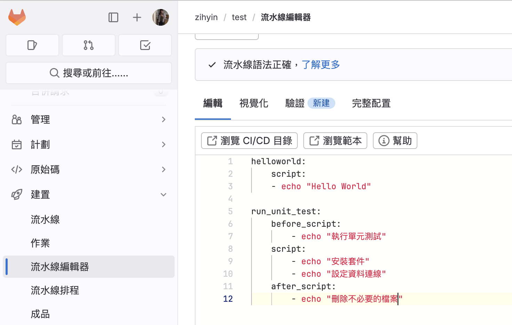
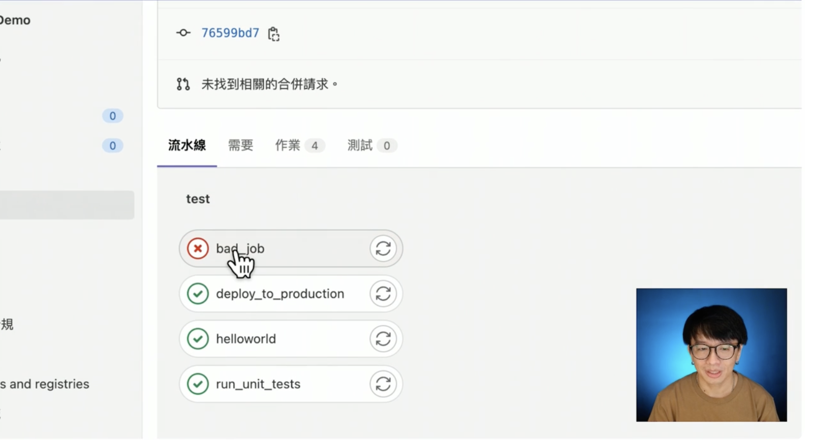
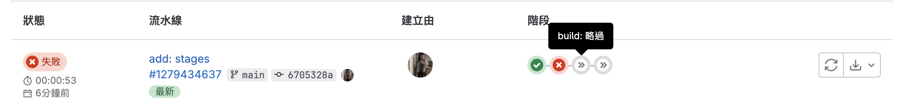
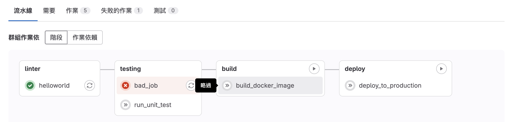
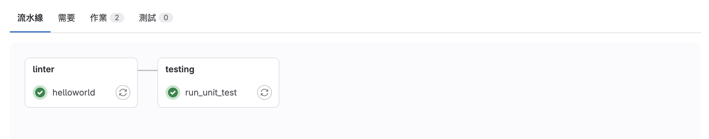
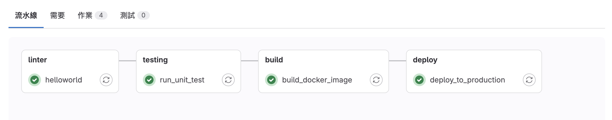
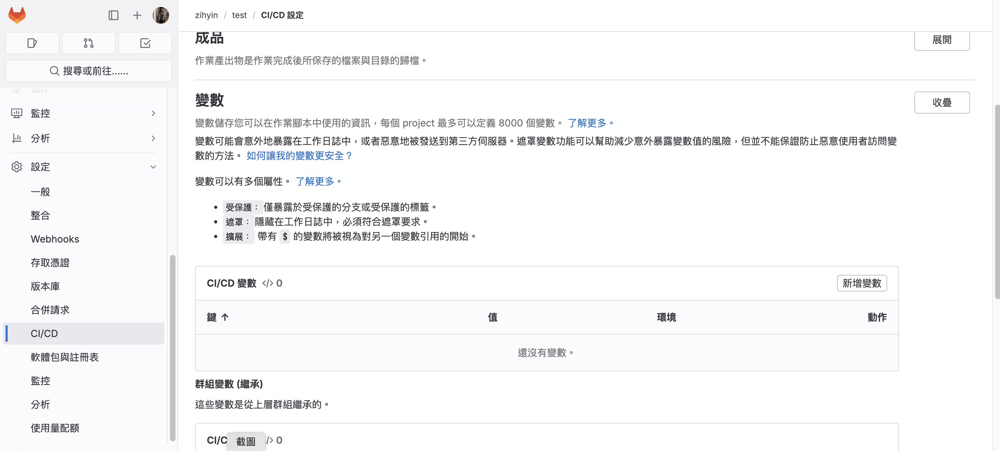

# gitLab CI/CD

## 什麼是 CI/CD?

一個完整的開發流程大概如下：

開發 > 上傳到 github/gitlab ( 或某個git 伺服器 ) > 跑測試 > 發PR > 打包 > 部署(dev) > 部署(staging) > 部署(production)



> CI : 指的是持續整合，表示從開發到打包這段過程。

> CD : 指的是持續交付/部署，表示從部署到 dev > production 這段過程。

## 建立 .gitlab-ci.yml

以下為一個簡單的 `.gitlab-ci.yml` 範例，該流程在每次提交時運行測試，並在提交到 main 時直接部署。

首先，我們先定義了兩個階段：`test` 和 `deploy`，`test` 會在所有分支運行，而 `deploy`只在 main 分支上運行。

```js
stages:
  - test
  - deploy

test:
  stage: test
  script: echo "Running tests" // 應替換為測試的指令
  only:
    - branches

deploy:
  stage: deploy
  script: echo "Deploying application" // 應替換為部署的指令
  only:
    - main
```

## 新增 Pipeline Job

到 [gitLab](https://about.gitlab.com/) 新增一個專案，並將 `SSH Key` 加入這個專案。



### 如何產出 SSH Key （ 以下出自 github copilot ）

在 macOS 中，你可以使用以下的步驟來生成一個新的 SSH key：

1. 打開 Terminal。

2. 輸入以下的命令來生成一個新的 SSH key。你需要將 your_email@example.com 替換為你的實際 email 地址：

```js
ssh-keygen -t ed25519 -C "your_email@example.com"
```

3. 當系統提示你 "Enter a file in which to save the key" 時，直接按 Enter。這會將 SSH key 儲存到預設的位置。

4. 當系統提示你輸入 passphrase 時，你可以選擇輸入一個 passphrase，或者直接按 Enter 略過。

### 來到 `建置` > `流水線編輯器` 來查看測試的指令是否正確。



> before_script : 在執行主任務之前的操作。

> script : 執行主任務。

> after_script : 在執行主任務之後的操作。

最後來到 `建置` > `流水線`，就可以查看剛剛所創造的 Pipeline ~

## 工作階段以及相依性

雖然是照著順序寫下來，但實際上他們是同時執行的，因此各個 job 之間其實沒有相依性，就算其中一個 job 掛掉了也不影響其他 job。



如果我們希望前面的 script 如果掛掉，就不要接下去執行，可以透過 `建立 stage` 來解決：

1. 先定義好 stage
2. 在每個 job 裡面指定對應的 stage

> 執行的順序會依據 stage 的順序而定

> 

如果在同一個 stage 裡面，我想指定 `bad_job` 過了，才會跑 `run_unit_test` ，那可以透過 `needs` 來解決：



```js{1-5,8,13,20,25,30}
stages:
    - linter
    - testing
    - build
    - deploy

helloworld:
    stage: linter
    script:
      - echo "Hello World"

run_unit_test:
    stage: testing
    needs: // [!code warning]
      - bad_job // [!code warning]
    script:
      - echo "執行單元測試"

bad_job:
    stage: testing
    script:
      - asdfdfg

build_docker_image:
    stage: build
    script:
      - echo "building docker image"

deploy_to_production:
    stage: deploy
    script:
      - echo "deploy to production"

```

## 執行外部檔案

若我們要執行的指令比較複雜，就可以將指令另外寫在別的檔案，再引入 yml 檔。假設我們要執行的外部檔案叫做 `run.sh`：

```js
// run.sh
echo "run in script"
ls -al // 列出目錄中的所有檔案
echo "run in again"
```

接著回到 yml 檔，將外部檔案引入：

```js{11,12}
stages:
    - linter
    - testing
    - build
    - deploy

helloworld:
    stage: linter
    script:
      - echo "Hello World"
      - chmod +x ./run.sh // 賦予 ./run.sh 的執行權限
      - ./run.sh
```

## 指定分支

若我們希望某些 CI/CD 的流程只在特定分支上執行，可以透過 `only` 來實現。

假設我希望 `build_docker_image`、`deploy_to_production` 只在 `main` 分支上執行，所以我們在這兩個 job 上用 `only` 指定，並另開一個測試分支來觀察，最後應該只會執行 `helloworld` 和 `run_unit_test`。

::: warning
和 `only` 相反的概念為 `except`，用法同下。
:::

```js{21-22,28-29}
stages:
  - linter
  - testing
  - build
  - deploy

helloworld:
  stage: linter
  script:
    - echo "Hello World"
    - chmod +x ./run.sh
    - ./run.sh

run_unit_test:
  stage: testing
  script:
    - echo "執行單元測試"

build_docker_image:
    stage: build
    only:
      - main
    script:
      - echo "building docker image"

deploy_to_production:
    stage: deploy
     only:
      - main
    script:
      - echo "deploy to production"
```



如果我們將測試分支合併進 `main` 分支，應該全部的 job 都會被成功執行。


## 環境變數

我們可以透過 `variables` 在 job 裡面使用變數，去控制 CI/CD 流程。

> variables 如果放在 job 裡面，代表該變數只存在在該 job 裡面。若要使其能在全域使用，就要將 `variables` 放到 job 之外。

```js{2-3,6}
helloworld:
  variables:
    myTestVar: "myTestVar"
  stage: linter
  script:
    - echo "Hello World $myTestVar"
```

```js{1-2,6}
variables:
  myTestVar: "myTestVar"
helloworld:
  stage: linter
  script:
    - echo "Hello World $myTestVar"
```

### workflow

`CI_COMMIT_BRANCH` 是 gitlab 預設的全域變數名稱。以下這段代表當分支為 main 時，才會執行，反之則不執行。

> 關於更多預設變數，詳見 [這裡](https://docs.gitlab.com/ee/ci/variables/predefined_variables.html)。

```js
workflow:
  rules:
    - if: $CI_COMMIT_BRANCH === "main"
      when: always
    - when : never
```

以下這段代表如果有人發 MR 過來，才會執行，反之則不執行。

```js
workflow:
  rules:
    - if: $CI_PIPELINE_SOURCE == "merge_request_event"
      when: always
    - when : never
```

### 環境變數的設定

除了預設的全域變數，如果我們還想要自由設定的話，可已從 `設定` > `CI/CD` > `變數` 新增或修改：



---

**來源：** [為你自己學 GitLab CI/CD](https://www.youtube.com/watch?v=-4XT8-znkuc&list=PLBd8JGCAcUAEwyH2kT1wW2BUmcSPQzGcu&index=1&ab_channel=%E9%AB%98%E8%A6%8B%E9%BE%8D)
