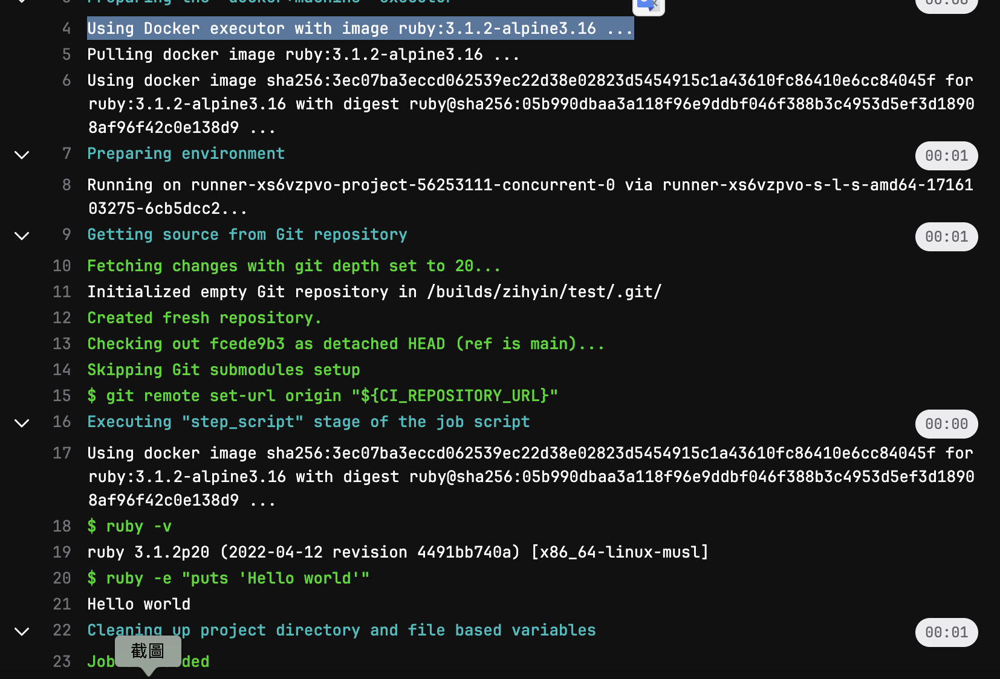
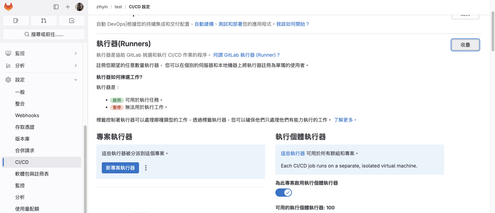
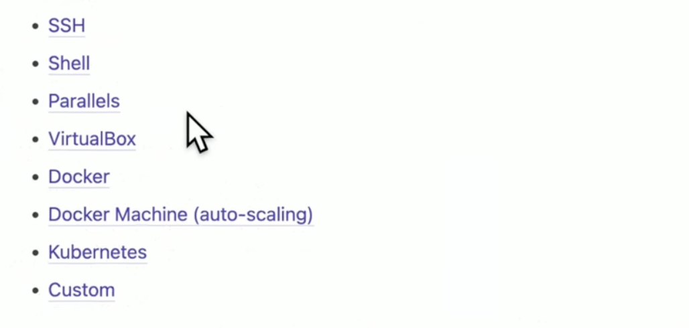
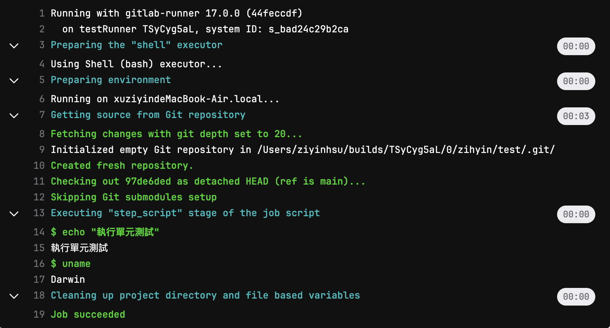
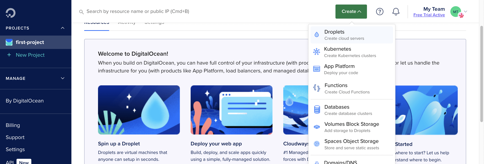

# gitLab CI/CD

## gitLab CI & Docker Image

可以使用 `image` 指定 Docker Image 的版本。

```yml{7}
stages:
  - linter
  - testing
  - build
  - deploy

image: alpine:latest // alpine 最新的版本。
```


放在 script 裡面的話，就只會在 script 裡面跑。

```yml
run_ruby_scripts:
  image: ruby:3.1.2-alpine3.16
  stage: testing
  script:
    - ruby -v
    - ruby -e "puts 'Hello world'"
```



## Runner & Executor

### Runner

> 居於 gitlab 與 Executor 之間的協調角色。

<!-- 這通常指的是一種工具或程式，它的工作是執行或運行其他的程式碼或腳本。例如，一個測試 Runner 就是用來執行測試程式碼的工具。 -->

::: info
一般來說，gitlab 都有自己的 Runner 可用，除非我們想自建 Runner。
:::



### Executor

> 主要的執行角色

<!-- 這通常指的是一種在特定的環境或條件下執行程式碼的實體。例如，在 Java 的並行程式設計中，一個 Executor 可以管理一個執行緒池，並控制這些執行緒如何並行地執行任務。 -->



### 在本機自建 gitlab runner

可根據 [Install Gitlab Runner](https://docs.gitlab.com/runner/install/) 安裝適合自己電腦的版本。

```js
sudo curl --output /usr/local/bin/gitlab-runner "https://s3.dualstack.us-east-1.amazonaws.com/gitlab-runner-downloads/latest/binaries/gitlab-runner-darwin-arm64"
```

給予 permission 去執行。

```
sudo chmod +x /usr/local/bin/gitlab-runner
```

```
gitlab-runner install
gitlab-runner start
```

#### 註冊 gitlab-runner

在 gitlab 上的路徑：設定 > CICD > Runners

```
gitlab-runner register // 該指令未來可能被棄用
https://gitlab.com/  // 如果是自建就輸入自建的 url
glrt-TSyCyg5aLnudBiLsqncE  // 輸入 gitlab-runner 的 token
shell // 這裡就端看自己要執行哪個 executor
```


#### 為流程指定 gitlab-runner

```js{3}
run_unit_tests:
  tags:
    - testRunner //指定 runner
  stage: testing
  script:
    - echo "執行單元測試"
    - uname
```



## 在 DigitalOcean 上安裝 GitLab

Digital Ocean 是一家美國的主機商，專門提供虛擬專用伺服器。我們可以在 [DigitalOcean](https://cloud.digitalocean.com/projects/dc32e990-1826-43bd-bd53-96b398478d81/resources?i=fe54cb) 註冊一個帳號，

選擇 `create` > `Droplets`：



地區可以選新加坡，OS 選 Ubuntu，，MarketPlace 選 Docker，SHARED CPU 選 Basic，CPU Options 選 Rugular，$6/month，Hostname 輸入 shopping-cat，選擇 SSH Key 登入（參見 [如何產生 SSH key](/DevOps/gitLabCICD/Day1.html#如何產出-ssh-key-以下出自-github-copilot)），最後 Create Droplets。

> 具體需求依個人而定，這裡練習用一切從簡～


接著可以用以下指令連上這台機器。

```bash
ssh root@159.89.205.93
# 確定有沒有連上
uname -a
# 確定有沒有 docker
which docker
# 確定 docker 版本
docker --version
```

來 [Install gitlab runner > Linux](https://docs.gitlab.com/runner/install/linux-repository.html)，因為我們剛 OS 選的是 Ubuntu，因此選擇以下指令：

```bash
# For Debian/Ubuntu/Mint:
curl -L "https://packages.gitlab.com/install/repositories/runner/gitlab-runner/script.deb.sh" | sudo bash
sudo apt-get install gitlab-runner
```

接著確認一下 gitlab-runner 有沒有正確安裝：

```bash
# 確認 gitlab-runner 是否正常運作
which gitlab-runner
gitlab-runner status
```

[註冊 runner](/DevOps/gitLabCICD/Day2.html#註冊-gitlab-runner)：

```bash
Enter a description for the runner:
Docker Runner on DigitalOcean

Enter tags for the runner (comma-separated):
do, remote, catRunner

# 選擇 executor
Enter an executor: docker, docker-windows, docker+machine, kubernetes, docker-autoscaler, instance, ssh, parallels, virtualbox, custom, shell:
docker

Enter the default Docker image (for example, ruby:2.7):
alpine
```

接著在 gitlab-ci 檔指定用這個新建的 runner:

```yml{14}
stages:
  - linter
  - testing
  - build
  - deploy

helloworld:
  stage: linter
  script:
    - echo "Hello World"

run_unit_test:
  tags:
    - catRunner
  stage: testing
  script:
    - echo "執行單元測試"
```

個人測試完畢後，記得要把 DROPLETS 刪掉，不然會一直扣錢～

## Group runner

一個群組裡面可以包含好幾個專案，而一個 Group runner 可以供同一群組內的專案共同使用。
進入群組後，找到 `一般` > `CICD`。


::: info
[官方對於 group runners 的說明](https://docs.gitlab.com/ee/ci/runners/runners_scope.html#group-runners)，提到利用令牌新增 runner 的方式已棄用。
:::

::: danger 疑問
目前個人測試開啟 `群組` 的 `CICD` 頁面時，發現沒有地方可以給我新增 group Runner，此項待研究。
:::


**來源：** [為你自己學 GitLab CI/CD](https://www.youtube.com/watch?v=tcW7rSh_gGI&list=PLBd8JGCAcUAEwyH2kT1wW2BUmcSPQzGcu&index=9&ab_channel=%E9%AB%98%E8%A6%8B%E9%BE%8D)
