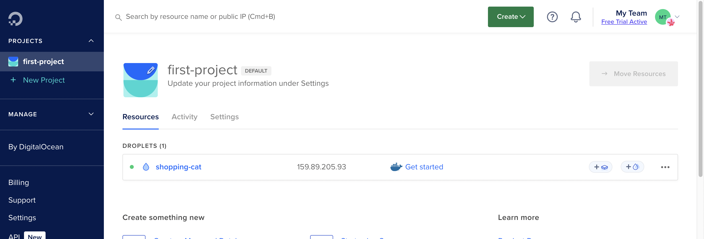
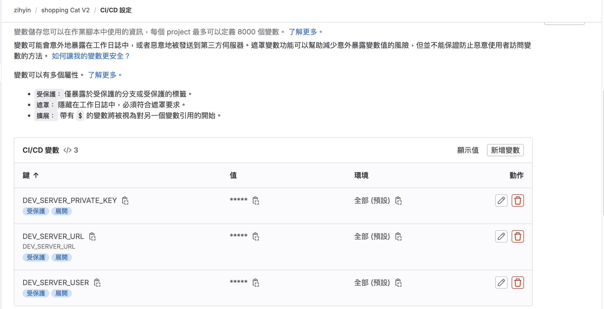
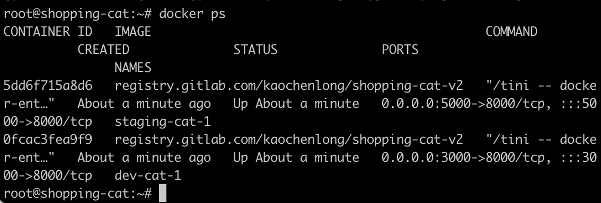
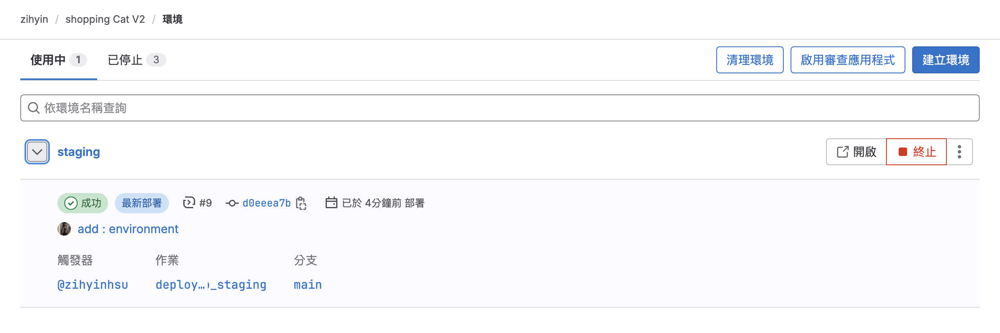

# gitLab CI/CD

## 使用 Docker Compose

我們可以在根目錄新增 `docker-compose.yml`。

```yml
version: '3.9'

services:
  # cat 為識別要開的網站，取名隨意
  cat:
    image: registry.gitlab.com/zihyin/shopping-cat-v2
    # APP_PORT 為指定對外的 port
    ports:
      - 3000:8000
    # 是否需要重新啟動
    restart: always
```

然後啟動 docker compose，就可以正確運行了。

```bash
# -d 會在背景執行
docker compose up -d
```

也可以用以下指令去停掉服務。

```bash
docker compose down
```

## 使用 SSH 連線伺服器

這裡一樣拿 Digital Ocean 來做練習～



我們可以透過 gitlab-ci 檔利用 SSH 連上 Digital Ocean，並進行操作。首先建立 SSH Key，參見 [如何產生 SSH key](/DevOps/gitLabCICD/Day1.html#如何產出-ssh-key-以下出自-github-copilot)。

確認一下在建立 droplets 時有沒有加入 SSH Key，如果沒有的話，可以到 `settings` > `Security` 新增 public key。

```bash
# 連線到遠端伺服器
ssh root@167.71.220.108
```

```bash
# 取得 public key
cat ~/.ssh/id_rsa.pub
```

```bash
# 使用 ssh-copy-id 命令將你的公鑰添加到遠端伺服器的 ~/.ssh/authorized_keys 檔案
# ssh-copy-id -i ~/.ssh/id_rsa.pub your_username@your_server_ip
ssh-copy-id -i ~/.ssh/id_rsa.pub root@167.71.220.108
```

```bash
# 查看 authorized_keys
cat ~/.ssh/authorized_keys
```

### 設定環境變數

> 根據這篇 [如何使用 SSH 連線到 Droplet](https://docs.digitalocean.com/products/droplets/how-to/connect-with-ssh/) 提到，要能成功連線，我們需要以下三種資料：

::: tip
To log in to your Droplet with SSH, you need three pieces of information:

1. The Droplet’s IP address
2. The default username on the server
3. The default password for that username, if you aren’t using SSH keys
   :::

```bash
# 取得 private key
cat ~/.ssh/id_rsa
```

到 gitlab 的 `設定` > `CI/CD` > `變數`，將 `private key`、`droplets IP`、`username` 分別存為變數。

> 這裡將 username 設為 root。



```yml{5,7-16}
stages:
  - testing
  - build
  - publish
  - deploy_to_dev

deploy_to_dev:
  stage: deploy_to_dev
  before_script:
  # 啟動了 SSH 代理程式。SSH 代理程式可以管理 SSH 私鑰，讓使用者不必每次都輸入密碼就能使用私鑰。
   - eval $(ssh-agent -s)
  # 將開發伺服器的 SSH 私鑰添加到 SSH 代理程式。
   - ssh-add <(echo "$DEV_SERVER_PRIVATE_KEY")
  script:
  # -o strictHostKeyChecking=no 參數告訴 SSH 不要檢查目標伺服器的 SSH 金鑰是否正確。
   - ssh -o strictHostKeyChecking=no $DEV_SERVER_USER@$DEV_SERVER_URL "ls -al"
```

## 部署 Image 到伺服器上

::: code-group

```yml [.gitlab-ci.yml]
stages:
  - testing
  - build
  - publish
  - deploy_to_dev

deploy_to_dev:
  stage: deploy_to_dev
  before_script:
    # 啟動了 SSH 代理程式。SSH 代理程式可以管理 SSH 私鑰，讓使用者不必每次都輸入密碼就能使用私鑰。
    - eval $(ssh-agent -s)
    # 將開發伺服器的 SSH 私鑰添加到 SSH 代理程式。
    - ssh-add <(echo "$DEV_SERVER_PRIVATE_KEY")
  script:
    # 這行命令使用 scp (安全拷貝) 來將本地的 docker-compose.yml 文件傳輸到遠程伺服器的 /root 目錄下。
    - scp -o strictHostKeyChecking=no ./docker-compose.yml $DEV_SERVER_USER@$DEV_SERVER_URL:/root
    # -o strictHostKeyChecking=no 參數告訴 SSH 不要檢查目標伺服器的 SSH 金鑰是否正確。
    - ssh -o strictHostKeyChecking=no $DEV_SERVER_USER@$DEV_SERVER_URL "
      docker compose down && docker compose up -d
      "
```

```yml [docker-compose.yml]
version: '3.9'

services:
  cat:
    image: registry.gitlab.com/zihyin/shopping-cat-v2
    ports:
      - 80:8000
    restart: always
```

:::
接著就可以透過 `http://167.71.220.108/` 順利連上了~

## 部署 Staging 伺服器

可以新增一個 stage 來部署到另一個伺服器，但這裡一樣用 Digital Ocean 並換不同的 port 來分辨。

::: info
請用 `docker ps` 檢查並確保遠端伺服器沒有 container 在運作～
:::

> 指定 COMPOSE_PROJECT_NAME : export COMPOSE_PROJECT_NAME=staging

> 指定要開的 port 號 : export APP_PORT=5000

::: code-group

```yml [.gitlab-ci.yml] {10,14-15,18-20}
deploy_to_staging:
  stage: deploy_to_staging
  before_script:
    # 啟動了 SSH 代理程式。SSH 代理程式可以管理 SSH 私鑰，讓使用者不必每次都輸入密碼就能使用私鑰。
    - eval $(ssh-agent -s)
    # 將開發伺服器的 SSH 私鑰添加到 SSH 代理程式。
    - ssh-add <(echo "$DEV_SERVER_PRIVATE_KEY")
  script:
    # 這行命令使用 scp (安全拷貝) 來將本地的 docker-compose.yml 文件傳輸到遠程伺服器的 /root 目錄下。
    - scp -o strictHostKeyChecking=no ./docker-compose.yml $DEV_SERVER_USER@$DEV_SERVER_URL:/root
    # -o strictHostKeyChecking=no 參數告訴 SSH 不要檢查目標伺服器的 SSH 金鑰是否正確。
    - >
      ssh -o strictHostKeyChecking=no $DEV_SERVER_USER@$DEV_SERVER_URL "
      export COMPOSE_PROJECT_NAME=staging
      export APP_PORT=5000
      docker compose down && docker compose up -d
      "
  environment:
    name: staging
    url: http://$DEV_SERVER_URL:5000
```

```yml [docker-compose.yml]{10}
version: '3.9'

services:
  # cat 為識別要開的網站，取名隨意
  cat:
    image: registry.gitlab.com/zihyin/shopping-cat-v2
    # APP_PORT 為指定對外的 port
    ports:
      # 把 port 變成 APP_PORT 這個變數，之後可在 gitlab-ci 檔指定
      - ${APP_PORT}:8000
    # 是否需要重新啟動
    restart: always
```

:::



接著就可以透過 `http://167.71.220.108/5000` 順利連上了～

然後來到 `操作` > `環境`，就可以看到剛剛建置的 `environment`。



## 整理重複的工作

## 手動部署 Production 環境

## Artifacts 產物

---

**來源：** [為你自己學 GitLab CI/CD](https://www.youtube.com/watch?v=22_fs3KUqVg&list=PLBd8JGCAcUAEwyH2kT1wW2BUmcSPQzGcu&index=18&ab_channel=%E9%AB%98%E8%A6%8B%E9%BE%8D)
