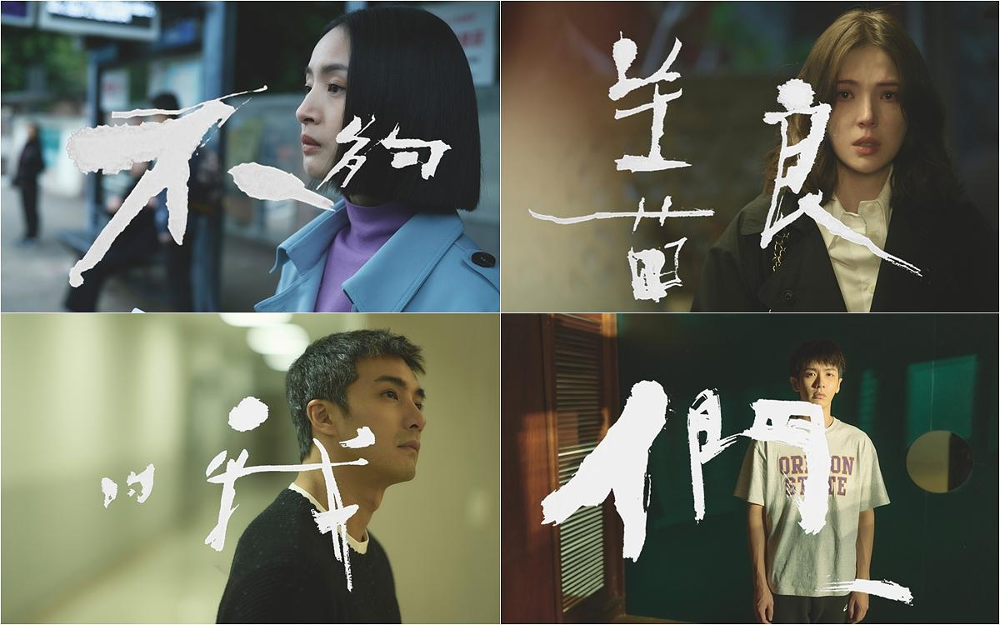
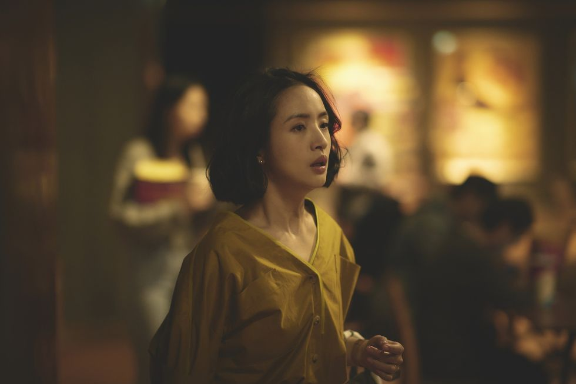
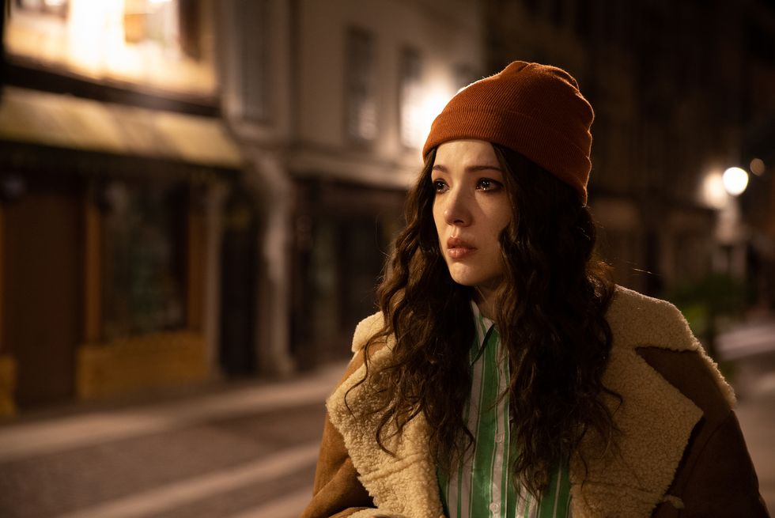
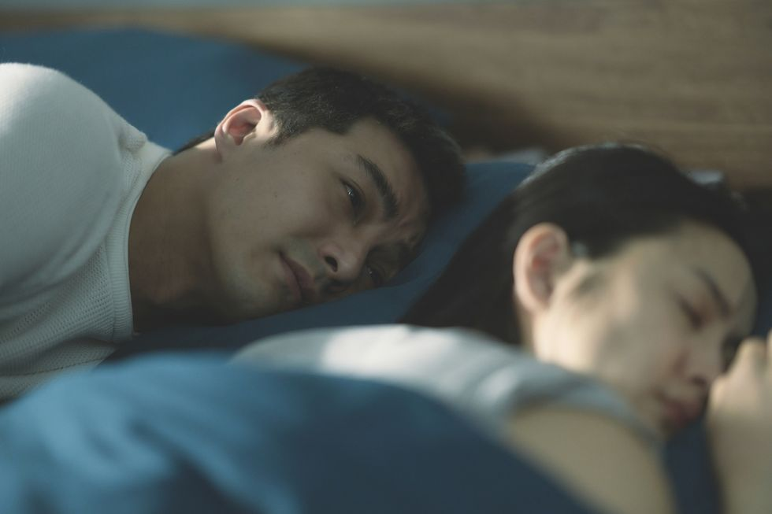
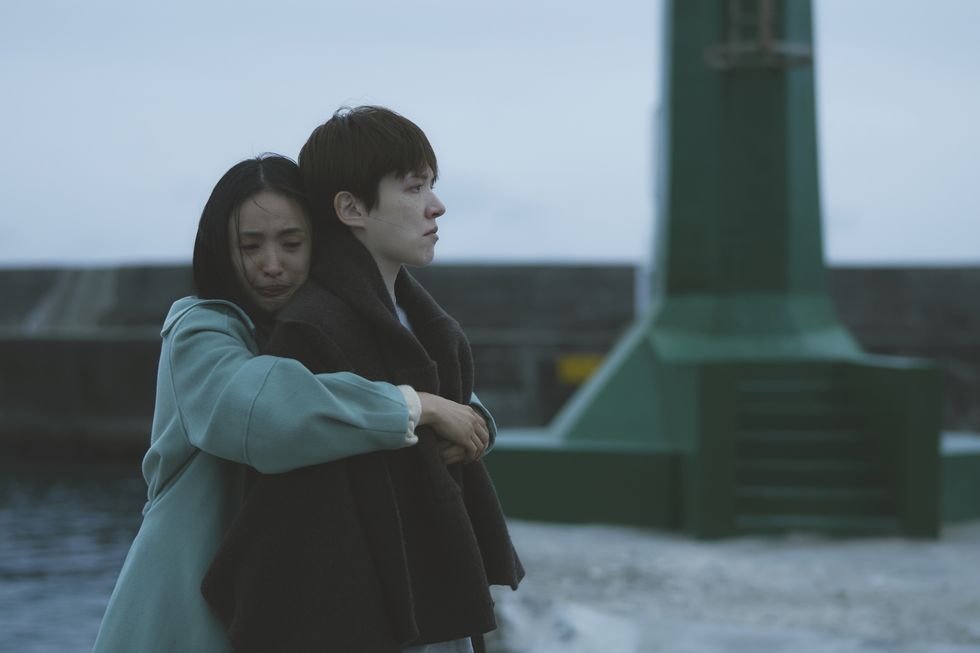

# 不夠善良的我們 EP1 - 8

---

<div class='embed-container'>
  <iframe width='560' height='315' src='https://www.youtube-nocookie.com/embed/fNDwhoaRG_M?rel=0' frameborder='0' allow='accelerometer; autoplay; encrypted-media; gyroscope; picture-in-picture' allowfullscreen></iframe>
</div>

::: info 劇情簡述
簡慶芬（林依晨飾），一位年屆不惑，擁有體貼老公、聽話兒子的幸福人妻。這樣溫馨的日常，對她而言卻逐漸流於「千遍一律」、「了無新意」。於是她決定替自己的「日復一日」找一個目標假想敵，此時她想起了十二年前，那位與她同月同日生、品味相似、甚至連男人都愛上同一個的前情敵 Rebecca（許瑋甯飾），忍不住好奇，她點開了她的社群，讀著貼文內躍然眼前「事業有成」、「獨立女性」形象的Rebecca，甚至還與新男友談起了十歲差距的姐弟戀，於是她暗下決心，自己絕不能輸...
:::

---



## 蝦的不甘心，魚怎麼知道 - 簡慶芬

> 不是所有的愛都肉眼可見，但一定有跡可循

這部劇與其說是兩個女人之間的量子糾纏，不如說是簡慶芬的人生成長史。

真正的主角其實至始至終都是簡慶芬，與 Rebecca 、 何瑞之之間的糾葛與劇情，都是讓簡慶芬對人生「頓悟」、「理解」與「放下」的過程。

雖然大家都心疼 Rebecca ，一邊罵簡慶芬小綠茶、心機又雙標（好笑並且全都是事實），一邊為 Rebecca 抱不平。但簡慶芬其實是一個很可愛的角色，一個懂得付出、也懂得爭取、會妒忌、會使壞，會同情、有笑有淚、有血有肉的小綠茶。

她心機，所以當她遇見了有好感的何瑞之，她努力博取何媽好感、討好何瑞之，將自己塞進優秀好媳婦框框中，成為得體、顧家、大方、與婆婆相處融洽的完美人妻形象，殊不知當初慫恿她追求何瑞之，曾經的「同一戰線」的婆婆，到頭來也不過對她挑三揀四，嫌她一無是處。

她雙標，一邊罵大嫂怎麼可以想把媽媽送療養院，結果不久後就面對婆婆的長照課題。我大概是從這裡開始喜歡上簡慶芬的，因為她至少有骨氣自圓其說ＸＤ 就算是逞強，她也辭了職全心全意照顧何媽，也在這個被生活反覆折磨的過程中，會因為一點點的鼓勵和安慰而獲得繼續堅持的力量，這樣的她，怎麼不可愛？

她畢竟看過何瑞之對 Rebecca 明目張膽的偏愛，所以 Rebecca 才會成為她婚姻中永遠的一根玫瑰刺，讓她既嫉妒又羨慕。因為她努力爭取這麼久的，對 Rebecca 卻是如此輕而易舉，她不想成為沒魚蝦也好的「蝦」，不想被「將就」、不想當備胎 ─── **蝦的不甘心，魚又怎麼會知道？**

也因為她始終放不下對 Rebecca 的執著，從這裡開始，大家開始大嗑簡Ｒ線，紛紛表示 **簡慶芬愛的其實根本是 Rebecca吧**（x

簡慶芬的問題，在於她放大了所有她見證過關於 Rebecca 可能留下的愛情證據，並將之一一劃上關係，以至於忽略了，她最在乎的問題，其實一直都有跡可循───其實那個紅葉蛋糕是她愛吃的、求婚時的戒指不是 Rebecca 的，只是猜錯了她的戒圍，原來何瑞之，沒有不在乎。



## 心底的微笑 - Rebecca

> 不是所有善良的人，都會被命運善待。

::: info ───
**「我這麼努力耶，我單槍匹馬的，連一個今天問我好不好的人都沒有，我又不投機不取巧，靠自己的實力忙到沒有朋友，剛剛才知道我的人生竟然是負面教材。」**

───
:::

Rebecca 小時候是她爸媽眼中的「拖油瓶」、年輕時是同事口中難搞的「不合群」、後來是何瑞之權衡之下放棄的「不得已」、總經理不能被知道的「知己」，在得知罹癌之後，又成了于向立不敢承擔的「猶豫」。

不幸的童年，讓 Rebecca 年輕時總是一臉生人勿近地頂著艾薇兒煙燻眼妝，對誰都淡漠無情，只有何瑞之看見了她武裝之下的柔軟、真心欣賞她的才華，成為第一個對她承諾一生的人。但就算何瑞之願意為她另築新家，試圖扛住來自母親的偏見，她知道，就像她也無法拋棄入獄惹事的哥哥一樣，面對家人，他們都有無法放下的理由。

就算當初與何瑞之結婚的是她，他們也注定會面對相似的難題 ─── 面對難搞的婆婆，簡慶芬尚有能力去處理與面對，如果是 Rebecca ，又該如何自處？

編劇真的很不善良，明明知道大家的生活苦多於甜，都想看好人有好報，但卻還是橫空給 Rebecca 劈了一道大雷。

### 孤獨 v.s. 孤單

漂泊的生活讓 Rebecca 時時不安，彆扭的性格也讓她無法輕易示弱，只能靠堅毅對抗這個世界的不堪。但一個人的單打獨鬥，終究有彈性疲乏的一天。

> 與其再次被拋棄，寧願成為先轉身就走的人，至少至少，他們會永遠記得那抹心底的微笑。

其實真正享受孤獨的人，都不會太孤單。「孤獨」與「孤單」的一字之差，或許就在於「安全感」與「內核力量的充盈」。而真正能夠與孤獨自處的人，因為有勇氣與自己誠實地對話，瞭解如何溫柔地自洽，所以能夠透過孤獨感受平靜與自在。

所以對 **「像 Rebecca ，有這麼糟糕嗎？」** 這題，就我看來，哪有什麼不好的呢？無論是建立家庭、還是一個人坦然自處的生活，說到底，不過就是取決於我們到底需要「誰」來給予安全感罷了。

關於 Rebecca 的結局，讓不少人都相當意難平，Rebecca 明明值得更好的人生，為什麼編劇偏偏要給她設下這樣一道又一道的苦難，她做錯什麼了嗎？

沒有。只是這個世界，本來就不慈悲。不是讓步就會被理解、不是努力就會有結果、不是善良就會被善待。



## 心動是本能，忠誠是選擇 - 何瑞之

觀眾們（包括簡慶芬本人）最好奇的問題之一，就是：**何瑞之到底有沒有愛過簡慶芬** ？

一開始我也覺得簡慶芬只是何瑞之失去 Rebecca 之後的「將就」，但在看完後四集之後... 仔細想想，難道這都不算愛？

```
Fake it till you make it.
```

或許何瑞之與簡慶芬之間的開始是因為「適合」，因為在那個時刻、剛好出現了愛他且適合的人選，他知道他無法、也解不開母親與 Rebecca 之間的矛盾，這就是他們之間的不適合。所以就算再來一次，他們還是會相愛、卻也還是會離別，因為愛與適合本來就不是必然，要遇到相愛與適合的關係，談何容易。

他或許懷念過那個有 Rebecca 的「如果」，所以一直捨不得刪掉手機裡那個被命名為「忘了」的號碼，或許他也沒想到，回過神來，簡慶芬竟然真的成為了他生命中的不可或缺，而他以為心中曾經的最愛，卻也真的在記憶中逐漸模糊了。

何瑞之當然有他 **又壞又爛** 的地方，比如一開始他因為簡慶芬的無微不至、對母親的貼心照護，就算內心明白自己當時還愛 Rebecca，但面對母親與女友之間無解的問題，他還是默許了簡慶芬的插足; 比如他自私，抱怨著簡慶芬不和婆婆一起住才導致何媽跌倒，好似沒有照顧好何媽的責任都是簡慶芬的鍋，只會軟弱地用冷暴力與沈默抗議，實際上當初選擇搬出家的決定，是他下的; 比如說理所當然地要簡慶芬離職照顧簡媽，忽略了簡慶芬也需要職場、事業的認同感; 比如他沒有好好表現過自己的愛，讓簡慶芬的心結可以糾纏這麼多年都解不開...

很多人說何瑞之對簡慶芬只是「感謝」與「責任」，我卻覺得並非僅此而已。或許和簡慶芬所想像的那種愛不同，他印象中的紅葉蛋糕，是簡慶芬愛吃的; 他猜測的戒圍，是簡慶芬的; 他在得知簡慶芬出軌、婚姻破碎之際，面對 Rebecca 再見面的邀約，「我很愛我老婆」是他的回答。他對 Rebecca 的心動與遺憾是真的，對簡慶芬的選擇，也是真的。因為簡慶芬不僅僅是誰的媽媽、女兒、老婆、一個愛地球的好人，還是何瑞之選擇攜手度過下輩子的另一半。

看到很多人一昧抨擊何瑞之媽寶男、自私膽小，比起愛老婆更愛自己，但何瑞之又不是偶像劇男主角，誰還不是個普通人了？

> 我們都有無能為力的課題，都有做錯過的選擇，都有看不清的盲點，都不夠善良。而這樣的不善良，很真實。

所以我覺得 ： **何瑞之對簡慶芬是有愛的**，如果要把這段十二年的婚姻，全歸於責任與將就，是否太淺薄了？

看到一堆自稱女權的人對何瑞之指手畫腳，說他只是利用、只不過是找女傭，然後開始扯父權、甚至上升到男凝，真的未免... 太把自己當回事了：） 只要是人，哪有什麼非黑即白？



---

### 結局雜感

最後 Rebecca 如願成為了所有人「心底的微笑」，她永遠是那樣聰明、獨立、認真、瀟灑，終於也成為了那顆讓簡慶芬永遠懷念的「硃砂痣」。

完結篇後，對於最後兩集兩人釋然和解的過程，很多人不能理解簡慶芬是以什麼心情去照顧 Rebecca，甚至怎麼突然就和解了（愛情來得太快就像龍捲風）以及「為什麼 Rebecca 這麼努力，編劇還要這樣對她～～」等等來自觀眾的怒吼ＸＤ，但我覺得這個轉折，Drama 的意料之外，情理之中（？

簡慶芬因為有照顧婆婆的經驗，又有勇於追愛的衝動（？，所以二話不說跑去台東的行為也很符合角色特性，再次證明簡Ｒ之間才是真愛（Ｘ

### 和解與理解



在確診乳癌後，Rebecca 聯絡了所有曾與她有過關係的男人（包含何瑞之），但沒有一個人有勇氣回應她。於是她隻身離開了喧囂的城市，一個人來到台東。

得知真相的簡慶芬，腦子一片轟然，這個她最大的對手，怎麼可以、怎麼會、又...怎麼辦？那刻她是真的心疼她，所以大罵于向立不懂愛，為何沒有在 Rebecca 最無助的時刻堅定選擇她，然後獨自開著何瑞之的車，一路驅車到台東，在吹著夜晚海風的碼頭上，找到了那個因為嫉妒而在心裡與之對話了十二年的她：

> 「這些年，我一直在心裡跟一個人說話，我原本以為那個人是何瑞之，可是我後來發現，那個人其實是妳。」

原來不只是簡慶芬，Rebecca 的每則貼文，也包含著對簡慶芬的字字斟酌，所以這場獨角戲裡，其實一直有兩個女主角。

她陪著她一邊倒數，一邊靜靜地度過生命中最後，每個陽光明媚、或大雨滂沱的日升月落。簡慶芬終於能單純以一個「老朋友」的角度看待 Rebecca，這根哽在她婚姻中十二年的刺，仔細看來，原來比起想象中還要脆弱，卻也還要可愛。

這段兩人相互理解、相互救贖，互相坦露，終於互相和解的過程，真的非常感動～～～

Rebbecca 在臨終前，說出了一直沒說出的秘密：因為媽媽根本無意生下她，於是拖了很久才報戶口，因此她根本不知道真正的生日。

人生，果然就是一連串的意想不到呢。
