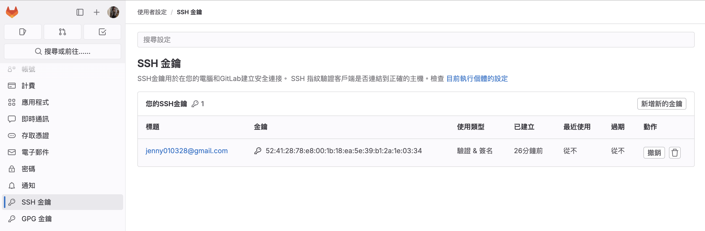
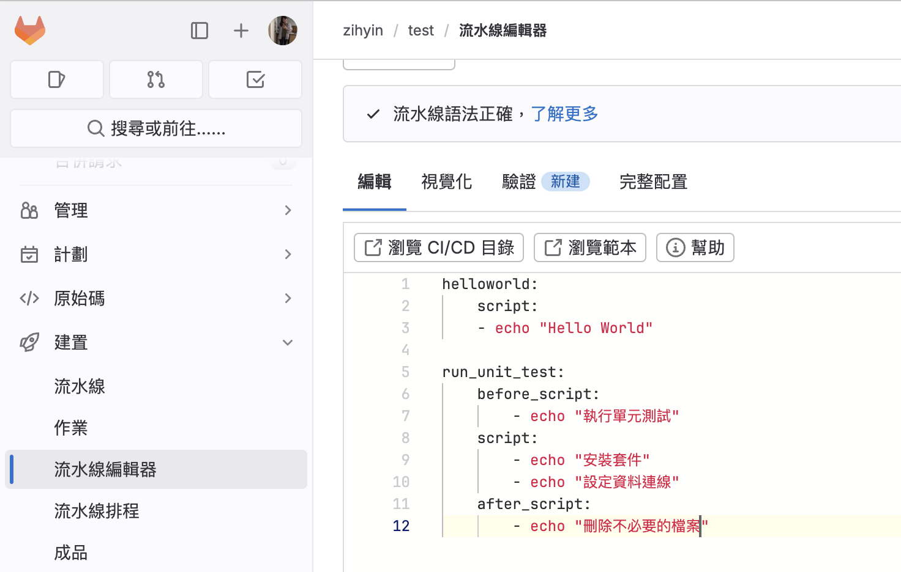

# gitLab CI/CD

## 什麼是 CI/CD?

一個完整的開發流程大概如下：

開發 > 上傳到 github/gitlab ( 或某個git 伺服器 ) > 跑測試 > 發PR > 打包 > 部署(dev) > 部署(staging) > 部署(production)


> CI : 指的是持續整合，表示從開發到打包這段過程。

> CD : 指的是持續交付/部署，表示從部署到 dev > production 這段過程。

## 建立 .gitlab-ci.yml

以下為一個簡單的 `.gitlab-ci.yml` 範例，該流程在每次提交時運行測試，並在提交到 main 時直接部署。

首先，我們先定義了兩個階段：`test` 和 `deploy`，`test` 會在所有分支運行，而 `deploy`只在 main 分支上運行。

```js
stages:
  - test
  - deploy

test:
  stage: test
  script: echo "Running tests" // 應替換為測試的指令
  only:
    - branches

deploy:
  stage: deploy
  script: echo "Deploying application" // 應替換為部署的指令
  only:
    - main
```

## 新增 Pipeline Job

到 [gitLab](https://about.gitlab.com/) 新增一個專案，並將 `SSH Key` 加入這個專案。



### 如何產出 SSH Key （ 以下出自 github copilot ）

在 macOS 中，你可以使用以下的步驟來生成一個新的 SSH key：

1. 打開 Terminal。

2. 輸入以下的命令來生成一個新的 SSH key。你需要將 your_email@example.com 替換為你的實際 email 地址：

```md
ssh-keygen -t ed25519 -C "your_email@example.com"
```

3. 當系統提示你 "Enter a file in which to save the key" 時，直接按 Enter。這會將 SSH key 儲存到預設的位置。

4. 當系統提示你輸入 passphrase 時，你可以選擇輸入一個 passphrase，或者直接按 Enter 略過。

### 來到 `建置` > `流水線編輯器` 來查看測試的指令是否正確。



> before_script : 在執行主任務之前的操作。

> script : 執行主任務。

> after_script : 在執行主任務之後的操作。

最後來到 `建置` > `流水線`，就可以查看剛剛所創造的 Pipeline ~

## 工作階段以及相依性

## 執行外部檔案

## 指定分支

## 環境變數

---

**參考資料：**

1. [為你自己學 GitLab CI/CD](https://www.youtube.com/watch?v=zCFFot5HnEw&list=PLBd8JGCAcUAEwyH2kT1wW2BUmcSPQzGcu&index=2)
