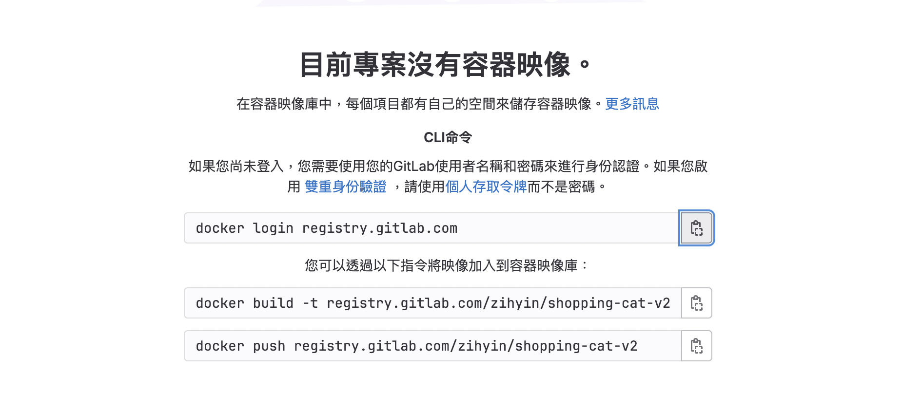
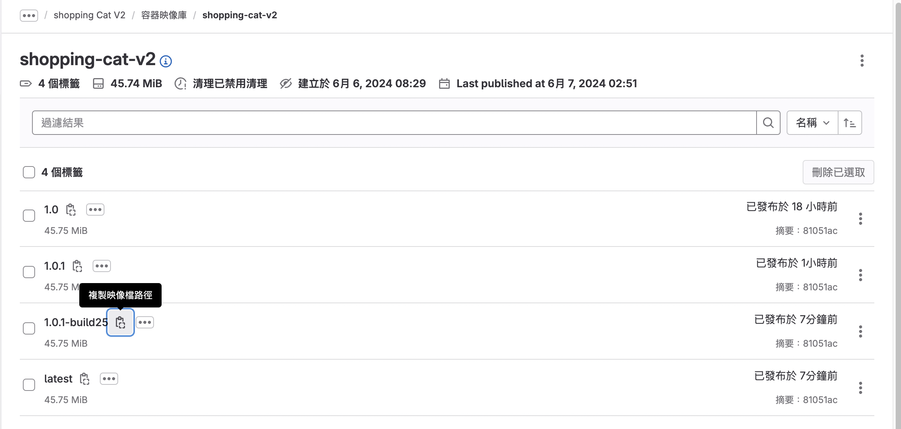

# gitLab CI/CD - 專案演練

來這邊 clone 這個 [測試專案](https://gitlab.com/kaochenlong/shopping-cat-v2.git)，跟著龍哥的 readme 來跑一次，首先要先在 mac 下載 deno，然後把它 run 起來。

```js
brew install deno
```

## 設定 Pipeline

到 gitlab 新增一個專案，把 clone 下來的 code 上傳到此專案內，並且在根目錄新增 `.gitlab-ci.yml`。

::: info
載下來的時候，其實就已有該檔案，但為練習用，我這裡會把它刪掉，跟著步驟做一次加深記憶～
:::


```yml
# 定義兩個 stages
stages:
  - testing
  - build

# job
run-test:
  stage: testing
  script:
    - deno test
```

上傳之後會跳出錯誤。因為此時使用的是預設的 Executor，而這個預設的 Executor 裡並不包含 deno。


於是我們可以來到 [deckerhub](https://hub.docker.com/r/denoland/deno) 找到 deno 的 image，在 yml 檔裡面指定它。

```yml{9}
# 定義兩個 stages
stages:
  - testing
  - build_image

# job
run-test:
  stage: testing
  image: denoland/deno:latest
  script:
    - deno test
```


## 把專案打包成 Docker Image

首先在根目錄新增一個 Dockerfile。來到 [deno 的 deckerhub tags](https://hub.docker.com/r/denoland/deno/tags)，找到 alpine 的固定版本，這裡選擇 `alpine-1.26.0` 這個版本。

```dockerfile
# 指定基礎的 image 檔
FROM denoland/deno:alpine-1.26.0

# 設定了工作目錄為 /app
WORKDIR /app

# 將當前目錄的所有檔案和目錄複製到容器的 /app 目錄。
COPY . /app

# 指定 8000 port
EXPOSE 8000

# 執行 deno 的指令，會預先下載和編譯 main.ts 檔案的所有依賴，以改善容器啟動時的性能。
RUN deno cache main.ts

# 指定了容器啟動時要執行的指令。
CMD [ "run", "--allow-all", "main.ts" ]
```

```bash
# 根據 dockerfile 建立 image
# hellocat 為 自訂的 dockerImageName
docker build -t hellocat .

# 找到剛剛建立的 image
docker images | grep hellocat
```

新增一個 `.dockerignore` 檔案，指定哪些檔案在建立 image 時，應該被 Docker 忽略。(用法和 `gitignore` 一樣)

```dockerignore
.dockerignore
Dockerfile
.vscode/
.gitlab-ci.yml
README.md
.git/
```

如此，在執行到 `WORKDIR /app` 時，就會忽略以上檔案或目錄到 `/app` 了，可以有效減少 image 的大小。

接著把這個 image run 起來：

```bash
# 代表我們可以透過訪問本地的 8000 port 來訪問容器的 8000 port
docker run -p 8000:8000  hellocat
```

此時我們可以透過修改 yml 檔，讓 CI 可以進行打包。不過就這樣再跑一次 CI 的話還是會報錯，因為用的還是 gitlab 預設的 shared runner，而 shared runner 本身不包含 docker，所以才會出錯。

以下我們有兩種方式來解決：

#### 在本地自建 runner

因此我們可以 [在本地自建 runner](/Frontend/gitLabCICD/Day2.html#註冊-gitlab-runner)，然後 executor 選擇 `shell`。(可以用 which docker 檢查 shell 是否有包含 docker)


```yml{14-15,18-19}
# 定義兩個 stages
stages:
  - testing
  - build

# job
run-test:
  stage: testing
  image: denoland/deno:latest
  script:
    - deno test

build-docker-image:
  # 指定自建 runner 的 tags
  tags:
    - shell
  stage: build
  # 只有當 run-test 有過才會跑 build-docker-image
  needs:
    - run-test
  script:
    - docker build -t hellocat .
```

#### 指定預設的 shared runner

我們可以指定 gitlab 預設有包含 docker 的 shared runner，並使用 `services` 來定義 job 需要的服務。這些服務會在 job 開始時啟動，並在 job 結束時停止。

```yml{16-17,19,21-22,24-25}
# 定義兩個 stages
stages:
  - testing
  - build

# job
run-test:
  stage: testing
  image: denoland/deno:latest
  script:
    - deno test

build-docker-image:
  stage: build
  # 指定 shared runner 的 tags
  tags:
    - gitlab-org-docker
  # 指定 docker 的 image
  image: docker:latest
  # 允許在 Docker 容器內運行 Docker。(dind = docker in docker)
  services:
    - docker:dind
  # 只有當 run-test 有過才會跑 build-docker-image
  needs:
    - run-test
  script:
    - docker build -t hellocat .
```

## 推上 Docker Registry

Docker Registry 是一種存儲 Docker image 的服務，其中 Docker Hub 是最知名的公開 Docker Registry，但 GitLab 也有提供內建的 Docker Registry 功能，因此以下我們會使用 GitLab 的 Docker Registry 來實作。

找到 `部署` > `容器映像庫`，並把 `build-docker-image` 的 script 改成 `docker build -t registry.gitlab.com/zihyin/shopping-cat-v2:1.0 .`

> `:1.0` 用於標示版號。



```yml{5,21,23-34}
# 定義兩個 stages
stages:
  - testing
  - build
  - publish

# job
run-test:
  stage: testing
  image: denoland/deno:latest
  script:
    - deno test

build-docker-image:
  tags:
    - shell
  stage: build
  needs:
    - run-test
  script:
    - docker build -t registry.gitlab.com/zihyin/shopping-cat-v2:1.0 .

push-to-registry:
  stage: publish
  tags:
    - shell
  needs:
    - build-docker-image
  # 這裡要先登入
  # $CI_REGISTRY_USER 和 $CI_REGISTRY_PASSWORD 是 GitLab CI/CD 預設的環境變數
  before_script:
    - docker login registry.gitlab.com -u $CI_REGISTRY_USER -p $CI_REGISTRY_PASSWORD
  script:
    - docker push registry.gitlab.com/zihyin/shopping-cat-v2:1.0
```

或是我們這邊也可以適時把一些固定值用預設的環境變數來替代。

> $CI_REGISTRY : registry.gitlab.com

> $CI_REGISTRY_IMAGE : registry.gitlab.com/zihyin/shopping-cat-v2

```yml{5,21,23-34}
# 定義兩個 stages
stages:
  - testing
  - build
  - publish

# job
run-test:
  stage: testing
  image: denoland/deno:latest
  script:
    - deno test

build-docker-image:
  tags:
    - shell
  stage: build
  needs:
    - run-test
  script:
    - docker build -t $CI_REGISTRY_IMAGE:1.0 .

push-to-registry:
  stage: publish
  tags:
    - shell
  needs:
    - build-docker-image
  # 這裡要先登入
  # $CI_REGISTRY_USER 和 $CI_REGISTRY_PASSWORD 是 GitLab CI/CD 預設的環境變數
  before_script:
    - docker login $CI_REGISTRY -u $CI_REGISTRY_USER -p $CI_REGISTRY_PASSWORD
  script:
    - docker push $CI_REGISTRY_IMAGE:1.0
```

此時回到 `容器映像庫` 就可以找到剛剛上傳的 image 了。


## 自動遞增 Image 版號

如果是普通前端專案，我們可以在 `packege.json` (以此專案來說是 `deno.json` )上新增一個 `version` 屬性並指定版號，之後透過 `jq` 與以下指令撈出版號，但需要預先安裝：

```bash
brew install jq
```

語法參考：

```bash
cat deno.json | jq -r .version
cat deno.json | jq -r .tasks.start
```

回到正題，對 yml 檔進行修改：

```yml{20-21,24,26,35-36,38-39}
# 定義兩個 stages
stages:
  - testing
  - build
  - publish

# job
run-test:
  stage: testing
  image: denoland/deno:latest
  script:
    - deno test

build-docker-image:
  tags:
    - shell
  stage: build
  needs:
    - run-test
  before_script:
    - export IMAGE_VERSION=$(cat deno.json | jq -r .version)
  script:
    # $CI_PIPELINE_IID : 每跑一次 build 的編號
    - docker build -t $CI_REGISTRY_IMAGE:$IMAGE_VERSION-build$CI_PIPELINE_IID .
    # latest 這個 tag 會跟著最新的版本
    - docker tag $CI_REGISTRY_IMAGE:$IMAGE_VERSION-build$CI_PIPELINE_IID $CI_REGISTRY_IMAGE:latest

push-to-registry:
  stage: publish
  tags:
    - shell
  needs:
    - build-docker-image
  before_script:
    - export IMAGE_VERSION=$(cat deno.json | jq -r .version)
    - docker login $CI_REGISTRY -u $CI_REGISTRY_USER -p $CI_REGISTRY_PASSWORD
  script:
    - docker push $CI_REGISTRY_IMAGE:$IMAGE_VERSION-build$CI_PIPELINE_IID
    - docker push $CI_REGISTRY_IMAGE:latest
```



之後如果要 run 這個 image，可以就以下指令開啟：

```bash
docker run -p 8000:8000 registry.gitlab.com/zihyin/shopping-cat-v2:latest
```

---

**來源：** [為你自己學 GitLab CI/CD](https://www.youtube.com/watch?v=htTkPwGsT48&list=PLBd8JGCAcUAEwyH2kT1wW2BUmcSPQzGcu&index=14&ab_channel=%E9%AB%98%E8%A6%8B%E9%BE%8D)
