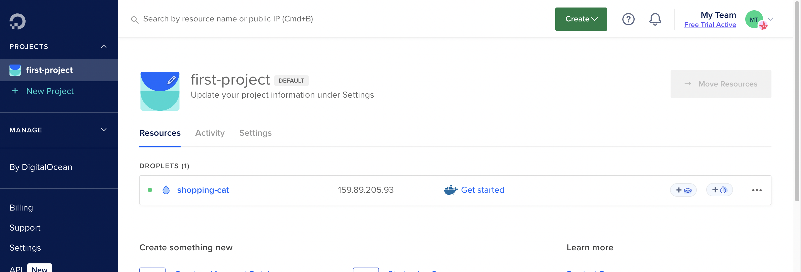

# gitLab CI/CD

## 使用 SSH 連線伺服器

這裡一樣拿 Digital Ocean 來做練習～



我們可以透過 gitlab-ci 檔利用 SSH 連上 Digital Ocean，並進行操作。首先建立 SSH Key，參見 [如何產生 SSH key](/Frontend/gitLabCICD/Day1.html#如何產出-ssh-key-以下出自-github-copilot)。

確認一下在建立 droplets 時有沒有加入 SSH Key，如果沒有的話，可以到 `settings` > `Security` 新增 public key。

```bash
# 取得 public key
cat ~/.ssh/id_rsa.pub
```

```bash
# 使用 ssh-copy-id 命令將你的公鑰添加到遠端伺服器的 ~/.ssh/authorized_keys 檔案
# ssh-copy-id -i ~/.ssh/id_rsa.pub your_username@your_server_ip
ssh-copy-id -i ~/.ssh/id_rsa.pub root@159.89.205.93
```

### 透過環境變數連線

> 根據這篇 [如何使用 SSH 連線到 Droplet](https://docs.digitalocean.com/products/droplets/how-to/connect-with-ssh/) 提到，要能成功連線，我們需要以下三種資料：

::: tip
To log in to your Droplet with SSH, you need three pieces of information:

1. The Droplet’s IP address
2. The default username on the server
3. The default password for that username, if you aren’t using SSH keys
   :::

```bash
# 取得 private key
cat ~/.ssh/id_rsa
```

到 gitlab 的 `設定` > `CI/CD` > `變數`，將 `private key`、`droplets IP`、`username` 分別存為變數。

> 這裡將 username 設為 root。


```yml{5,7-16}
stages:
  - testing
  - build
  - publish
  - deploy_to_dev

deploy_to_dev:
  stage: deploy_to_dev
  before_script:
  # 啟動了 SSH 代理程式。SSH 代理程式可以管理 SSH 私鑰，讓使用者不必每次都輸入密碼就能使用私鑰。
   - eval $(ssh-agent -s)
  # 將開發伺服器的 SSH 私鑰添加到 SSH 代理程式。
   - ssh-add <(echo "$DEV_SERVER_PRIVATE_KEY")
  script:
  # -o strictHostKeyChecking=no 參數告訴 SSH 不要檢查目標伺服器的 SSH 金鑰是否正確。
   - ssh -o strictHostKeyChecking=no $DEV_SERVER_USER@$DEV_SERVER_URL "ls -al"
```

---

**來源：** [為你自己學 GitLab CI/CD](https://www.youtube.com/watch?v=22_fs3KUqVg&list=PLBd8JGCAcUAEwyH2kT1wW2BUmcSPQzGcu&index=18&ab_channel=%E9%AB%98%E8%A6%8B%E9%BE%8D)
