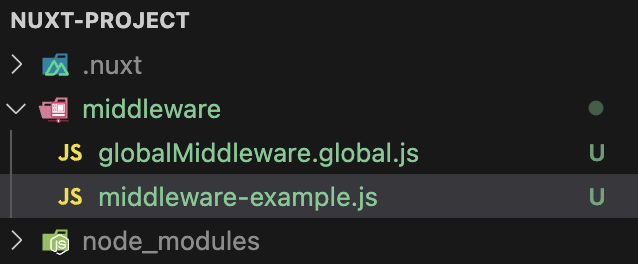

# Middleware

Middleware 相當於 Nuxt 內的路由守衛（Route Guards），讓我們 **在服務器端渲染期間**、**訪問其他路由之前/之後**、**特定頁面**，或者在 **全域** 能依據需求來執行 **自定義的邏輯判斷** 或 **重新導向**。

## 匿名中間件 (Inline Middleware)

在使用的頁面上直接定義，在頁面渲染之前執行，可在 `definePageMeta` 中實現。

```vue
<script setup>
definePageMeta({
  middleware: [
    function (to, from) {
      console.log(to, from);
    },
  ],
});
</script>

<template>
  <div>
    <h1>About page</h1>
  </div>
</template>
```

## 具名中間件 (Named Middleware)

在 `middleware/` 資料夾底下定義，在訪問頁面時會自動地非同步導入，可在 `definePageMeta` 中實現。

::: code-group

```js [middleware/middleware-example.js]{1,8,12}
export default defineNuxtRouteMiddleware((to, from) => {
  console.log(to, from);
});
```

```vue [about.vue]
<script setup>
definePageMeta({
  middleware: ['middleware-example'],
});
</script>
<template>
  <div>
    <h1>About page</h1>
  </div>
</template>
```

:::


## 全域中間件 (Global route Middleware)

在 `middleware/` 資料夾底下定義，檔名需附 `.global` 後綴，在所有路由切換時自動執行。

::: code-group

```js [middleware/globalMiddleware.global.js]
export default defineNuxtRouteMiddleware((to, from) => {
  console.log('globalMiddleware', to, from);
});
```

```vue [about.vue]
<script setup></script>

<template>
  <div>
    <h1>About page</h1>
  </div>
</template>
```

:::

## 執行順序

執行順序：全域中間件 > 定義的 middleware (依照順序)

```vue
<script setup>
definePageMeta({
  middleware: [
  // 匿名
  function(to,from)(){
    console.log(to,from)
  },
  // 具名
  'middleware-example'],
});
</script>
<template>
  <div>
    <h1>About page</h1>
  </div>
</template>
```

因此依此例，順序為：全域 > 匿名 > 具名

## 如何管理多個全域 middleware?

我們可以在檔案名稱用 `數字` 為其標號， Nuxt 3 會根據檔案名稱中的數字大小來決定執行順序。

```js
10.note.global.js
01.note.global.js
02.note.global.js
```

執行順序： `01.note.global.js` > `02.note.global.js` > `10.note.global.js`

## navigateTo & abortNavigation

我們可以透過 `navigateTo` 或 `abortNavigation` 來決定導航、或者阻擋進入某個路由。

```js{8,12}
export default defineNuxtRouteMiddleware((to, from) => {
  console.log(to, from);

  const isLoggedIn = true;
  const hasPermission = false;

    if (!isLoggedIn) {
        return navigateTo('/login');
    }

    if (!hasPermission) {
        return abortNavigation({
            statusCode: 403
            statusMessage: '無頁面權限'
        });
    }
});
```

## 動態新增 Middleware

在 `plugins/` 資料夾底下定義 middleware，會自動應用於所有路由。

### 匿名

```js
// plugins/route-middleware.js
export default defineNuxtPlugin(() => {
  addRouteMiddleware((to, from) => {
    console.log('my-plugin', to, from);
  });
});
```

### 具名

```js{3}
// plugins/route-middleware.js
export default defineNuxtPlugin(() => {
  addRouteMiddleware('checkAboutPage', (to, from) => {
    const route = useRoute();
    if (route.path === '/about') {
      // 檢查用戶是否有訪問此頁面的權限
      console.log('正在訪問 about 頁面');
    }
  });
});
```

### 全域

```js{10}
// plugins/route-middleware.js
export default defineNuxtPlugin(() => {
  addRouteMiddleware('checkAboutPage', (to, from) => {
    const route = useRoute();
    if (route.path === '/about') {
      // 檢查用戶是否有訪問此頁面的權限
      console.log('正在訪問 about 頁面');
    }
  },
  { global: true }
  );
});
```

## 路由驗證

```vue{5-10}
<script setup>
const route = useRoute();
const { id } = route.params;

definePageMeta({
  validate: async (route) => {
    // 檢查 id 是否由數字組成
    return /^\d+$/.test(route.params.id);
  },
});
</script>

<template>
  <div>
    <h1>ID: {{ id }}</h1>
  </div>
</template>
```

---

**參考資料：**

1. [middleware](https://nuxt.com/docs/guide/directory-structure/middleware)
2. [Nuxt.js 3.x Middleware 目錄－監聽路由變化](https://clairechang.tw/2023/09/05/nuxt3/nuxt-v3-middleware/#google_vignette)
