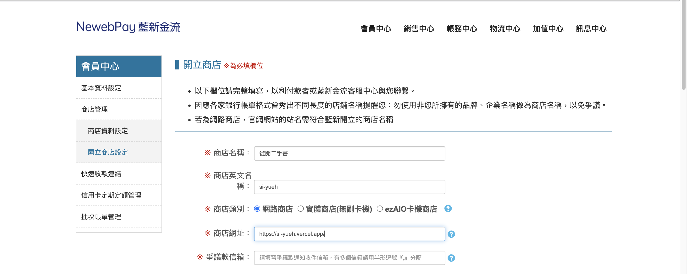

# 整合 藍新金流

## 帳號申請

申請一個藍新金流的帳號，來到 `會員中心 > 商店管理` 來開立一個商店。



## 環境變數設定

這裡的資料可以從 [藍新金流的測試站](https://cwww.newebpay.com/) ，申請帳號後從 `商店管理` 取得：

```env
# .env
MerchantID= # 商店 ID
HASHKEY= # 商店 HashKey
HASHIV= # 商店 HashIV
Version=2.0 # 串接程式版本，2023 年版本為 2.0

ReturnUrl= # 前端回傳網址
NotifyUrl= # 交易結果通知網址
PayGateWay=https://ccore.newebpay.com/MPG/mpg_gateway # 測試機、正式機 API 路徑
```

付款完成後會導回 ReturnURL，並同時將付款結果資料傳到 NotifyURL。因此要開一支 notify API ，並填在 NotifyURL 裡，以接收交易成功後回傳的資料。

```env
ReturnUrl = https://si-yueh.vercel.app/orderResult
NotifyUrl = https://si-yueh.vercel.app/api/notify
```

## 流程

建立訂單 > 確認訂單 > 轉至藍新 (信用卡、ATM、超商) 支付 > 用戶 redirect

1. 將表單的資料加密後，透過 post 傳至 https://ccore.newebpay.com/MPG/mpg_gateway，如此將會轉往藍新金流的頁面。因表單預設行為會轉址，所以如果用 fetch 方法發送請求，無法模擬 HTML 表單的轉址行為，因此可以用 JS 產生一個模擬的表單，再將資料傳過去。

2. 傳出去的資料經藍新驗證後，會依據 `NotifyURL` 回傳資料，須經解密後才能獲得正確資料，最後將訂單資料儲存至資料庫。

## 程式碼實作

### server API

::: code-group

```ts [server/api/order/encrypt.post.ts]
/** 加密資料 */
import { AESencrypt, orderInLocal, SHA256encrypt } from '~/server/utils/crypto';

export default defineEventHandler(async (event) => {
  const data = await readBody(event);
  const {
    newebpay: { MerchantID, Version, NotifyUrl, ReturnUrl },
  } = useRuntimeConfig();
  // 使用 Unix Timestamp 作為訂單編號（金流也需要加入時間戳記）
  const TimeStamp = Math.round(new Date().getTime() / 1000);
  const order = {
    ...data,
    TimeStamp,
    MerchantID,
    Amt: parseInt(data.totalPrice),
    MerchantOrderNo: TimeStamp,
    Version,
    NotifyUrl,
    ReturnUrl,
    Email: data.email,
  };

  // 進行訂單加密
  // 加密第一段字串，此段主要是提供交易內容給予藍新金流
  const aesEncrypt = AESencrypt(order);
  // 使用 HASH 再次 SHA 加密字串，作為驗證使用
  const shaEncrypt = SHA256encrypt(aesEncrypt);
  order.TradeInfo = aesEncrypt;
  order.TradeSha = shaEncrypt;

  orderInLocal.value = order;
  return defineWrappedResponseHandler(
    getResponseStatus(event),
    event.method,
    order,
  );
});
```

```ts [server/api/notify/index.post.ts]
/** 解密加密內容，若成功則將訂單存至資料庫 */
import { PrismaClient } from '@prisma/client';
import { AESdecrypt, orderInLocal, SHA256encrypt } from '~/server/utils/crypto';

const prisma = new PrismaClient();

export default defineEventHandler(async (event) => {
  const data = await readBody(event);

  // 解密交易內容
  if (data.Status === 'SUCCESS' && orderInLocal.value) {
    const aesdecrypt = AESdecrypt(data.TradeInfo);
    // 取得交易內容，並查詢本地端資料庫是否有相符的訂單
    if (
      !orderInLocal.value.MerchantOrderNo ===
      aesdecrypt?.Result?.MerchantOrderNo
    ) {
      return defineWrappedResponseHandler(
        404,
        event.method,
        null,
        '找不到訂單',
      );
    }
    // 使用 HASH 再次 SHA 加密字串，確保比對一致（確保不正確的請求觸發交易成功）
    const thisShaEncrypt = SHA256encrypt(data.TradeInfo);
    if (thisShaEncrypt !== data.TradeSha) {
      return defineWrappedResponseHandler(
        404,
        event.method,
        null,
        '付款失敗：TradeSha 不一致',
      );
    }
    orderInLocal.value.payTime = aesdecrypt?.Result?.PayTime || '';
  }

  // 存進資料庫
  const orderInDataBase = await prisma.order.findFirst({
    where: {
      userId: orderInLocal.value.userId,
      payTime: String(orderInLocal.value.payTime),
    },
  });

  if (orderInDataBase)
    return defineWrappedResponseHandler(
      404,
      event.method,
      null,
      '付款失敗：訂單已存在',
    );

  const {
    userId,
    email,
    name,
    cellphone,
    address,
    totalPrice,
    bookIds,
    payTime,
    notes,
  } = orderInLocal.value;
  const order = await prisma.order.create({
    data: {
      userId,
      email,
      name,
      cellphone,
      address,
      totalPrice,
      bookIds,
      payTime,
      notes,
    },
  });

  // 清空購物車
  const cart = await prisma.cart.findFirst({
    where: {
      userId: orderInLocal.value.userId,
    },
  });
  if (cart) {
    await prisma.cartBook.deleteMany({
      where: {
        cartId: Number(cart?.id),
      },
    });
  }

  return defineWrappedResponseHandler(
    getResponseStatus(event),
    event.method,
    order,
  );
});
```

```ts [server/api/order/index.post.ts]
/** 取得資料庫的訂單資料 */
import { PrismaClient } from '@prisma/client';
import { serverSupabaseUser } from '#supabase/server';

const prisma = new PrismaClient();

export default defineEventHandler(async (event) => {
  const user = await serverSupabaseUser(event);
  if (!user) {
    event.res.statusCode = 403;
    return defineWrappedResponseHandler(403, event.method, null);
  }

  const orderInDataBase = await prisma.order.findMany({
    where: {
      userId: user?.id,
    },
    orderBy: {
      id: 'desc', // 按照 id 倒序
    },
  });
  const orderWithBooks = await Promise.all(
    orderInDataBase.map(async (item) => {
      const transferBooks = await Promise.all(
        item.bookIds?.map(async (id) => {
          const books = await prisma.books.findFirst({
            where: {
              id,
            },
          });
          return books || [];
        }),
      );
      return { books: transferBooks, ...item };
    }),
  );

  return defineWrappedResponseHandler(
    getResponseStatus(event),
    event.method,
    orderWithBooks,
  );
});
```

:::

### cart 與 server utils

::: code-group

```vue [cart.vue]
<script lang="ts" setup>
import { validateData } from '~/utils/validate';

const user = useSupabaseUser();
if (!user.value) await navigateTo('/login');
const { cartData, patchCart, deleteCart } = useCartData();

const order = ref<encryptOrderType>({
  email: null,
  name: null,
  cellphone: null,
  address: null,
  notes: '',
  userId: '',
  totalPrice: 0,
  bookIds: [],
  ItemDesc: '',
});

const { EncryptOrder, encryptOrderData } = useOrderData();
async function handleSendOrder() {
  const validateResult = validateData(order.value);
  if (!validateResult) return;
  if (cartData.value) {
    order.value.userId = cartData.value?.userId;
    order.value.totalPrice = cartData.value?.totalPrice;
    order.value.bookIds = cartData.value?.books.map((item) => item.id);
    order.value.ItemDesc = cartData.value?.books
      .map((item) => item.title)
      .join(',');
  }
  await EncryptOrder(order.value);
  await sendOrderTonewebPay(encryptOrderData.value);
}

async function sendOrderTonewebPay(encryptOrderData) {
  const form = document.createElement('form');
  form.method = 'POST';
  form.action = 'https://ccore.newebpay.com/MPG/mpg_gateway';

  // 設置表單的 enctype 屬性
  form.enctype = 'application/x-www-form-urlencoded';

  // 將 orderData 轉換為 URLSearchParams 並添加到表單中
  const {
    MerchantID,
    TradeSha,
    TradeInfo,
    TimeStamp,
    Version,
    NotifyUrl,
    ReturnUrl,
    MerchantOrderNo,
    Amt,
    ItemDesc,
    Email,
  } = encryptOrderData;
  const data = {
    MerchantID,
    TradeSha,
    TradeInfo,
    TimeStamp,
    Version,
    NotifyUrl,
    ReturnUrl,
    MerchantOrderNo,
    Amt,
    ItemDesc,
    Email,
  };
  const params = new URLSearchParams(data);
  for (const [key, value] of params) {
    const input = document.createElement('input');
    input.type = 'hidden';
    input.name = key;
    input.value = value;
    form.appendChild(input);
  }

  document.body.appendChild(form);
  form.submit();
}
</script>
```

```ts [server/utils/crypto.ts]
/** 共用方法 */
import CryptoJS from 'crypto-js';
import { ref } from 'vue';

const {
  newebpay: { MerchantID, HASHKEY, HASHIV, NotifyUrl, ReturnUrl, Version },
} = useRuntimeConfig();
const RespondType = 'JSON';

// 字串組合
export function genDataChain(order: any) {
  return `MerchantID=${MerchantID}&TimeStamp=${
    order.TimeStamp
  }&Version=${Version}&RespondType=${RespondType}&MerchantOrderNo=${
    order.MerchantOrderNo
  }&Amt=${order.Amt}&NotifyURL=${encodeURIComponent(
    NotifyUrl,
  )}&ReturnURL=${encodeURIComponent(ReturnUrl)}&ItemDesc=${encodeURIComponent(
    order.ItemDesc,
  )}&Email=${encodeURIComponent(order.Email)}`;
}

// AES 加密
export function AESencrypt(TradeInfo: any) {
  const key = CryptoJS.enc.Utf8.parse(HASHKEY);
  const iv = CryptoJS.enc.Utf8.parse(HASHIV);
  const encrypted = CryptoJS.AES.encrypt(genDataChain(TradeInfo), key, {
    iv: iv,
    mode: CryptoJS.mode.CBC,
    padding: CryptoJS.pad.Pkcs7,
  });
  return encrypted.ciphertext.toString(CryptoJS.enc.Hex);
}

// AES 解密
export function AESdecrypt(TradeInfo: any) {
  const key = CryptoJS.enc.Utf8.parse(HASHKEY);
  const iv = CryptoJS.enc.Utf8.parse(HASHIV);
  const encryptedHexStr = CryptoJS.enc.Hex.parse(TradeInfo);

  const encryptedBase64Str = CryptoJS.enc.Base64.stringify(encryptedHexStr);

  const decrypted = CryptoJS.AES.decrypt(encryptedBase64Str, key, {
    iv: iv,
    mode: CryptoJS.mode.CBC,
    padding: CryptoJS.pad.Pkcs7,
  });
  const decryptedText = decrypted.toString(CryptoJS.enc.Utf8);
  // eslint-disable-next-line no-control-regex
  const result = decryptedText.replace(/[\x00-\x20]+/g, '');
  return JSON.parse(result);
}
// sha256 加密
export function SHA256encrypt(aesEncrypt: any) {
  const plainText = `HashKey=${HASHKEY}&${aesEncrypt}&HashIV=${HASHIV}`;
  return CryptoJS.SHA256(plainText).toString(CryptoJS.enc.Hex).toUpperCase();
}

export const orderInLocal = ref(null);
```

:::

**參考資料：**

1. [Node.js 串接第三方支付 - 藍新金流｜六角學院｜2023 鐵人賽 #12](https://www.youtube.com/watch?v=-eg-fRDWNFg&ab_channel=%E5%85%AD%E8%A7%92%E5%AD%B8%E9%99%A2)
