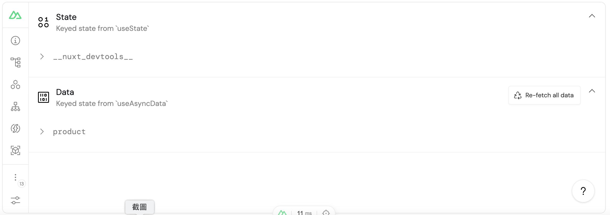
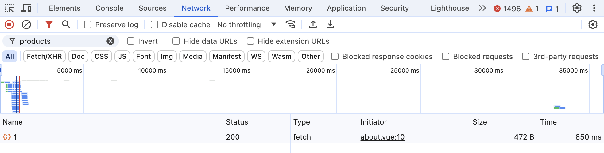

# useFetch

`useFetch` 是基於 `useAsyncData` 和 `$fetch` 進行包裝而成的組合式函數。`useAsyncData` 用於處理非同步數據獲取與響應式更新，`$fetch` 則用於發起 http 請求。

> `useFetch` 結合了兩者功能，可以從遠端服務器獲取數據並自動處理響應式更新。

p.s. 若我們希望在獲取多個 API 的值後返回一個物件，可以透過 `useAsyncData` 來封裝。

## 透過閉包動態更改請求 URL

以下情境為：**透過呼叫 `fetchProduct` 以增加 `id` 的值，並調用 `refresh()` 方法來重新獲取 product。**

當我們直接傳遞 url 給 `useFetch`，預期新增 `id` 的值後以調用 `refresh()` 方法來取得最新資料，然而實際上當我們觀察 console.log 時，雖然 id 的值有增加，但 API 的呼叫並沒有隨著 id 的增加而更改。

因爲此時的 `refresh()` 只是重新執行最初的請求，即使 `id` 的值已經改變，`refresh()` 方法不會重新計算傳遞給 `useFetch` 的 URL， 因此請求的 URL 也不會更新。

> 因此，此方法僅適用於確定的 URL，且在請求發起前無需額外處理邏輯。

```vue{3}
<script setup>
const id = ref(1);
const { data: product, refresh } = await useFetch(`https://fakestoreapi.com/products/${id.value}`);
const fetchProduct = async () => {
  ++id.value;
  console.log('ID',id.value);
  await refresh();
  console.log('Product',product.value);
};
</script>

<template>
  <div>
    <FwbButton color="default" @click="fetchProduct">DefaultBTN</FwbButton>
  </div>
</template>
```

在使用 `useFetch` 時，如果需要根據某些參數動態更改請求的 URL，可將 URL 包裝成一個函式傳遞給 `useFetch`。如此，每次調用 `refresh()` 方法時，都會重新計算 URL。

因閉包的特性，使函式可捕獲外部作用域中的 `id` 變數，函式能記住並訪問所在作用域的變數，從而根據最新的參數發送請求。

```vue{3-5}
<script setup>
const id = ref(1);
const { data: product, refresh } = await useFetch(() => {
  return `https://fakestoreapi.com/products/${id.value}`;
});
const fetchProduct = async () => {
  ++id.value;
  console.log('ID',id.value);
  await refresh();
  console.log('Product',product.value);
};
</script>

<template>
  <div>
    <FwbButton color="default" @click="fetchProduct">DefaultBTN</FwbButton>
  </div>
</template>
```

## useFetch 的參數：

useFetch 的參數分為兩大類： `URL/請求配置` 和 `選項配置`。

### URL (string 或 Function)

指定要請求的 URL。如果是函數，則每次調用 refresh 方法時，都會重新計算 URL。

### 請求配置 / 選項配置 (options)

詳情請見 [官方文檔](https://nuxt.com/docs/api/composables/use-fetch#params)

## useFetch 的回傳值

1. data (Ref): 包含從遠端獲取的數據。
2. error (Ref): 如果請求失敗，這裡會包含錯誤信息。
3. pending (`Ref<boolean>`): 表示請求是否正在進行中。
4. refresh/execute (Function): 一個函數，用於手動重新發起請求。
   ...

這裡列出幾個常見的，實際詳情請見 [官方文檔](https://nuxt.com/docs/api/composables/use-fetch#return-values)

## 如何阻止重複請求

> 重複請求，指的是阻止短時間向特定端點發出新請求，或是阻止對相同資源的多個同時請求，這將有效管理伺服器負載、提高效率且確保系統的行為可預測。

Nuxt 3 透過每次 useFetch 請求，根據 URL 和 options 來自動生成一組 key，藉此來判斷是否為同一請求。若 key 相同，Nuxt 3 就會阻止發出新的請求。

雖然 Nuxt 3 會自動生成 key，但我們仍然可以手動指定一個 key。例如當不同的請求應該被視為相同的請求，或者想要強制刷新某個請求時，我們就可以透過 `手動指定 key` 來控制 **發出請求/阻擋請求**。

```vue{4}
<script setup>
const { data: product, refresh } = await useFetch(
  `https://fakestoreapi.com/products/${id.value}`,
  { key: 'product' },
);
</script>
```

我們可以透過 Nuxt devtools 來查看剛剛指定的 key:



## 用 lazy 在導航後立即顯示預設文字

當我們導航到 `about` 頁面後，並預期立即看到數據時，Nuxt 會等待所有數據成功加載後才完成導航。若我們希望可以先導航至該頁面，同時用一些 **預設文字** (如:正在加載數據) 來提示用戶，我們可以這麼做：

> default 可用來預設數據未加載前的狀態

::: code-group

```vue [index.vue]
<template>
  <NuxtLink to="/about">About</NuxtLink>
</template>
```

```vue [about.vue]
<script setup>
const {
  data: product,
  refresh,
  execute,
  pending,
} = await useFetch(
  () => {
    return 'https://fakestoreapi.com/products/1';
  },
  {
    // 使用 lazy: true 來延遲請求的執行
    lazy: true,
  },
);
</script>
<template>
  <div>
    <h1>About page</h1>
    <div v-if="pending">正在加載數據</div>
    <div v-else>{{ product }}</div>
  </div>
</template>
```

:::

## 用 immediate 來控制獲取數據的時機

當元件創建時，useFetch 會自動執行，但我們可以透過將 immediate options 設定為 false ，直到需要時才觸發數據加載，如此可有效減少初始頁面加載的資源，優化性能與提升用戶體驗。

比如：用戶手動執行操作、滿足某條件後執行操作。

> default 可用來預設數據未加載前的狀態

```vue{5}
<script setup>
const id = ref(1);
const { data:product, refresh } = useFetch(()=>`https://fakestoreapi.com/products/${id.value}`,
  {
    immediate: false,
    default: () => {
      return '尚未獲得資料';
  }
})

const fetchProduct = async () => {
  ++id.value;
  console.log('ID',id.value);
  await refresh();
  console.log('Product',product.value);
};
</script>

<template>
    <fwb-button color="default"  @click="fetchProduct">Default Button</fwb-button>
    <div>{{ product }}</div>
</template>
```

## 用 getCachedData 快取數據

在處理重複請求時，透過 `getCachedData` 可以從客戶端緩存中獲取先前取得的數據，避免重複發送相同的請求。

::: code-group

```vue [index.vue]
<template>
  <NuxtLink to="/about">About</NuxtLink>
</template>
```

```vue [about.vue]{2,14-16}
<script setup>
const nuxtApp = useNuxtApp();
const {
  data: product,
  refresh,
  execute,
  pending,
} = await useFetch(
  () => {
    return 'https://fakestoreapi.com/products/1';
  },
  {
    lazy: true,
    getCachedData: (key) => {
      return nuxtApp.payload.data[key] || nuxtApp.static.data[key];
    },
  },
);
</script>
<template>
  <div>
    <h1>About page</h1>
    <div v-if="pending">正在加載數據</div>
    <div v-else>{{ product }}</div>
  </div>
</template>
```

:::

我們可以觀察到，無論導航到 `about` 的頁面幾次，因爲設定了快取，所以只會出現一次請求。



---

**參考資料：**

1. [useFetch](https://nuxt.com/docs/api/composables/use-fetch)
2. [[Day 15] Nuxt 3 資料獲取 (Data Fetching)](https://ithelp.ithome.com.tw/articles/10301876)
