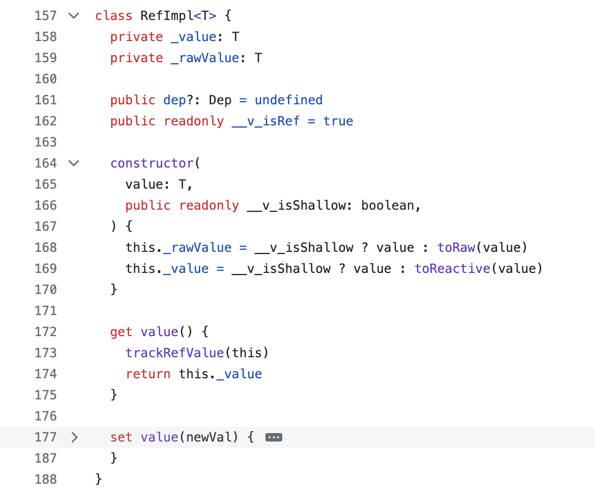

# 響應式系統

## 響應系統的作用與實現

### 副作用函式 與 響應式數據

> 副作用函式 : 會產生副作用的函式。

```js
// 全域變數
let val = 1;
function effect() {
  val = 2; // 修改全域變數，形成副作用
}
```

響應式數據 : 當數據的變化會導致視圖的變化時，那麼它就是一個響應式數據。

### 響應式數據的實現

響應式數據的核心邏輯，無非`數據讀取的 getter` 行為與 `數據修改的 setter` 行為，與之對應的 API 在 Vue 2 是 `Object.defineProperty`，在 Vue 3 則是 `Proxy`。

### 構建完善的響應式系統

具體實現邏輯可參考 [Vue 3.2 源码系列：03-看呆面试官的《手写响应式模块》](https://juejin.cn/post/7189161043552108599)

### 調度系統 ( scheduler )

---

#### 響應性的可調度性

> 定義：當數據更新，觸發 effect 函式重新執行時，有能力決定 effect 函式執行的時機、次數與方式。

```bash
1;
2;
'end';
```

```bash
# 假設需求有變，輸出順序須調整為：
1;
'end';
2;
```

#### 實現原理

基於 Set 構建了`隊列 jobQueue`，利用 `Promise 的異步特性`，控制執行順序。

1. 使用 Set 構建隊列（jobQueue）：這裡使用了 JavaScript 的 Set 數據結構來存儲待執行的任務（jobs）。Set 的特點是能夠存儲唯一值，這確保了即使同一任務多次被加入隊列，它也只會被執行一次，從而避免了不必要的重複計算。

2. 利用 Promise 的異步特性控制執行順序：通過將隊列中的任務包裝在 Promise 中，Vue 能夠利用 JavaScript 的事件循環和微任務隊列（microtask queue）來控制任務的執行時機。即使多個數據更新幾乎同時發生，Vue 也能夠將相關的 DOM 更新合併到一次事件循環中，從而提高性能。

### 計算屬性 ( computed )

當依賴的響應式數據發生變化，執行重新計算。其原理也是依賴 `調度系統 ( scheduler )` 來實現。

### 惰性執行 ( lazy )

其本質是一個布林的值，可被添加至 effect 函式當中，用來控制副作用的執行。

### watch 的實現原理

監聽一個響應式數據，當數據發生變化時，通知並執行相應的 callback function。watch 的原理就是基於 `調度系統` 和 `惰性執行` 來實現的。

### 過期的副作用

---

#### 競態問題

指的是 **程序的行為依賴於事件或者任務的執行順序或者時機**，當這個順序或時機無法保證時，就可能導致不可預期的結果。

當有多個異步請求同時去更新同一個數據源時，最終數據的狀態依賴於這些請求完成的順序，而這個順序是不確定的。如果你先發送了一個請求 A 去獲取一個列表的最新數據，然後又發送了請求 B 去獲取相同列表的數據，理論上我們希望最後的數據是請求 B 的結果，但是如果請求 A 延遲返回，它的結果可能會覆蓋請求 B 的結果，導致界面顯示的是過時的數據。

#### 解決方式: oninvalidate 原理

oninvalidate 會在 effect 函式下一次重新執行前調用，可以用來清除無效的 effect，例如等待中的異步請求。

## 非原始值(Object)的響應式方案

---

#### Proxy

代理一個 Object (被代理對象)的 getter 和 setter 行為，得到一個 proxy 實例。

#### Reflect

在 Proxy 使用 this 時，保證 this 指向 proxy，透過正確的指向，從而保證 effect 有被正確執行。

## 原始值的(非 Object) 的響應式方案

Proxy 只能代理複雜資料類型，那麼對於簡單資料類型，我們可以透過 `ref` 來構建響應式數據。至於 `reactive` 因基於 proxy 實現，所以只能完成 Object 的響應。

對於簡單資料類型，Vue 透過 get、set 函式標記符，讓我們能像調用屬性一樣調用函式，使 **函式以屬性調用的形式被觸發**。因此當我們使用 `.value` 來訪問屬性時，實際上就是在執行 `value()` 這個函式。

在此附上[源碼](https://github.com/vuejs/core/blob/main/packages/reactivity/src/ref.ts):



---

**來源：**

1. [一小时读完《Vue.js 设计与实现》](https://www.bilibili.com/video/BV1K24y1q7eJ/?spm_id_from=333.999.0.0&vd_source=bf9e31cbb04dcc9c09d7c5869df8ca09)
2. [Vue.js 設計與實現](https://www.tenlong.com.tw/products/9787115583864)
